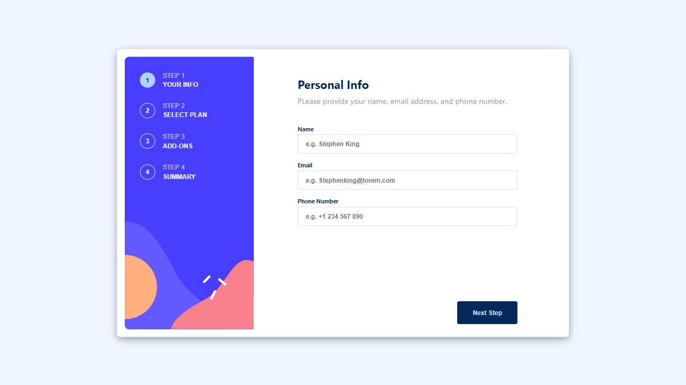

# Frontend Mentor - Multi-step form solution

This is a solution to the [Multi-step form challenge on Frontend Mentor](https://www.frontendmentor.io/challenges/multistep-form-YVAnSdqQBJ). Frontend Mentor challenges help you improve your coding skills by building realistic projects.

## Table of contents

- [Overview](#overview)
  - [The challenge](#the-challenge)
  - [Screenshot](#screenshot)
  - [Links](#links)
- [My process](#my-process)
  - [Built with](#built-with)
  - [What I learned](#what-i-learned)
  - [Continued development](#continued-development)
  - [Useful resources](#useful-resources)
- [Author](#author)
- [Acknowledgments](#acknowledgments)
- [Run locally](#run-locally)

**Note: Delete this note and update the table of contents based on what sections you keep.**

## Overview

### The challenge

Users should be able to:

- Complete each step of the sequence
- See a summary of their selections on the final step and confirm their order
- View the optimal layout for the interface depending on their device's screen size
- See hover and focus states for all interactive elements on the page

### Screenshot



### Links

- Solution URL: [Solution URL](https://github.com/ArielGalvez/multi-step-form)
- Live Site URL: [Demo](https://multi-step-form-challenge.netlify.app/)

## My process

- Layout the mockups using mobile fist
- Adap the components to desktop view using media-queries
- Integrate the compoenents with formkik
- Add validations with yup and integrate with formik
- Handle pricings
- Refactor code
- Describe solution
- Configure CI/CD with github actions

### Built with

- Semantic HTML5 markup
- CSS
- Flexbox
- CSS Grid
- Mobile-first workflow
- [Typescript](https://www.typescriptlang.org/) - programming languaje
- [React](https://reactjs.org/) - JS library
- [CSS modules](https://github.com/css-modules/css-modules) - For styles `still pure CSS`

### What I learned

I wanted to practice my CSS skills and build something by using mockups. And the same time Im training a friend and told him that I will build something that he can use as an example.
Lately, I have been using only component frameworks libraries such as material-ui, chakra-ui and others, so I wanted to remember how it tastes to build our custom components with React.
I don't feel comfortable explaining how it was, but I'm pretty sure you won't find `any` in the whole code.
Something that I feel proud is the layout, they are the same components. just resizing using media-queries.

### Continued development

I would like to have another complex design to implement, on my free time as part of my hoobies I like implement figma designs using html+css.
Maybe in the future I will go for React Native.

### Useful resources

- [w3schools](https://www.w3schools.com/tags/att_input_type_checkbox.asp) - heplful to look html input props.
- [Formik Doc](https://formik.org/docs/guides/validation) - Useful to get shape of the schema and validate form with Yup.

## Author

- Website - [Ariel Galvez Ponce](https://github.com/ArielGalvez)
- Frontend Mentor - [@ArielGalvez](https://www.frontendmentor.io/profile/ArielGalvez)
- Instagram - [arielgalvezponce](https://www.instagram.com/arielgalvezponce/)
- Linkedin - [ariel-gálvez-3b5119260](https://www.linkedin.com/in/ariel-g%C3%A1lvez-3b5119260/)

## Acknowledgments

Thanks to the frontend mentor for providing the screenshots and palette of colors.

## Run locally

```script
    npm start
```
